# Flow Diagram - MockS1 Strategy

## General Architecture

```mermaid
flowchart TD
    Start([User]) --> CheckPaused{Is paused?}
    CheckPaused -->|Yes| RevertPaused[❌ Revert MockS1__Paused]
    CheckPaused -->|No| Action{What action?}
    
    Action -->|Deposit| DepositFlow[depositToStrategy]
    Action -->|Withdraw| WithdrawFlow[withdrawFromStrategy]
    Action -->|Query| ViewFlow[totalAssets]
    Action -->|Report| ReportFlow[report]
    
    DepositFlow --> DepositDetails
    WithdrawFlow --> WithdrawDetails
    ViewFlow --> ViewDetails
    ReportFlow --> ReportDetails
```



## Deposit Flow (depositToStrategy)

```mermaid
flowchart TD
    Start([depositToStrategy amount]) --> CheckPaused1{Is paused?}
    CheckPaused1 -->|Yes| Revert1[❌ Revert MockS1__Paused]
    CheckPaused1 -->|No| Accrue1[_accrue<br/>Update accumulator]
    
    Accrue1 --> CheckCap{principal + amount > cap?}
    CheckCap -->|Yes| RevertCap[❌ Revert MockS1__CapExceeded]
    CheckCap -->|No| UpdatePrincipal[principal += amount]
    
    UpdatePrincipal --> CalculateTotal[totalAssetsAfter = principal * accumulator / SCALE]
    CalculateTotal --> EmitDeposit[📤 Emit S1Deposited<br/>amount, principal, totalAssetsAfter, timestamp]
    EmitDeposit --> End1([End])
```



## Withdrawal Flow (withdrawFromStrategy)

```mermaid
flowchart TD
    Start([withdrawFromStrategy amount]) --> CheckPaused2{Is paused?}
    CheckPaused2 -->|Yes| Revert2[❌ Revert MockS1__Paused]
    CheckPaused2 -->|No| Accrue2[_accrue<br/>Update accumulator]
    
    Accrue2 --> CalculateCurrent[currentTotalAssets = principal * accumulator / SCALE]
    CalculateCurrent --> CheckBalance{amount > currentTotalAssets?}
    CheckBalance -->|Yes| RevertBalance[❌ Revert MockS1__InsufficientBalance]
    CheckBalance -->|No| CalculatePrincipal[principalToReduce = amount * SCALE / accumulator]
    
    CalculatePrincipal --> UpdatePrincipal2[principal -= principalToReduce]
    UpdatePrincipal2 --> CalculateAfter[totalAssetsAfter = principal * accumulator / SCALE]
    CalculateAfter --> EmitWithdraw[📤 Emit S1Withdrawn<br/>amount, principal, totalAssetsAfter, timestamp]
    EmitWithdraw --> End2([End])
```



## View Flow (totalAssets)

```mermaid
flowchart TD
    Start([totalAssets]) --> AccrueView[_accrueView<br/>Calculate accumulator without modifying state]
    
    AccrueView --> CheckInit{lastAccrualTs == 0?}
    CheckInit -->|Yes| ReturnScale[Return SCALE]
    CheckInit -->|No| CheckZero{aprBps == 0 OR principal == 0?}
    
    CheckZero -->|Yes| ReturnAccum[Return accumulator]
    CheckZero -->|No| CalculateDt[dt = block.timestamp - lastAccrualTs]
    
    CalculateDt --> CheckDt{dt == 0?}
    CheckDt -->|Yes| ReturnAccum
    CheckDt -->|No| CalculateRate[ratePerSecondScaled = absApr * SCALE / (10000 * YEAR)]
    
    CalculateRate --> CalculateDelta[deltaScaled = ratePerSecondScaled * dt]
    CalculateDelta --> CheckSign{sign == 1?}
    
    CheckSign -->|Yes Positive APR| FactorAdd[factor = SCALE + deltaScaled]
    CheckSign -->|No Negative APR| CheckOverflow{SCALE < deltaScaled?}
    
    CheckOverflow -->|Yes| FactorZero[factor = 0]
    CheckOverflow -->|No| FactorSub[factor = SCALE - deltaScaled]
    
    FactorAdd --> CalculateAccum[accumulatorValue = accumulator * factor / SCALE]
    FactorSub --> CalculateAccum
    FactorZero --> CalculateAccum
    
    CalculateAccum --> ReturnTotal[Return principal * accumulatorValue / SCALE]
    ReturnScale --> ReturnTotal
    ReturnAccum --> ReturnTotal
    ReturnTotal --> End3([End])
```

## Report Flow (report)

```mermaid
flowchart TD
    Start([report]) --> CheckPaused3{Is paused?}
    CheckPaused3 -->|Yes| Revert3[❌ Revert MockS1__Paused]
    CheckPaused3 -->|No| CheckPrincipal{principal == 0?}
    
    CheckPrincipal -->|Yes| Revert4[❌ Revert MockS1__InsufficientBalance]
    CheckPrincipal -->|No| CheckApr{aprBps == 0?}
    
    CheckApr -->|Yes| Revert4
    CheckApr -->|No| CheckAccum{accumulator == SCALE?}
    
    CheckAccum -->|Yes No yield| Revert4
    CheckAccum -->|No Has yield| Accrue3[_accrue<br/>Update accumulator]
    
    Accrue3 --> CalculateTotal2[currentTotalAssets = principal * accumulator / SCALE]
    CalculateTotal2 --> CalculateGain[gain = currentTotalAssets - principal]
    
    CalculateGain --> UpdatePrincipal3[principal = currentTotalAssets<br/>Realize yield]
    UpdatePrincipal3 --> ResetAccum[accumulator = SCALE<br/>Reset to 1.0]
    
    ResetAccum --> UpdateTimestamp[lastAccrualTs = block.timestamp]
    UpdateTimestamp --> EmitReport[📤 Emit S1Reported<br/>gain, newPrincipal, timestamp]
    EmitReport --> End4([End])
```



## Accrual Flow (_accrue)

```mermaid
flowchart TD
    Start([_accrue]) --> CheckInit2{lastAccrualTs == 0?}
    CheckInit2 -->|Yes First use| Init[lastAccrualTs = block.timestamp<br/>accumulator = SCALE]
    Init --> End5([End])
    
    CheckInit2 -->|No| CalculateDt2[dt = block.timestamp - lastAccrualTs]
    CalculateDt2 --> CheckDt2{dt == 0?}
    CheckDt2 -->|Yes| End5
    
    CheckDt2 -->|No| CheckZero2{aprBps == 0 OR principal == 0?}
    CheckZero2 -->|Yes| UpdateTime[lastAccrualTs = block.timestamp]
    UpdateTime --> End5
    
    CheckZero2 -->|No| GetAbsApr{aprBps > 0?}
    GetAbsApr -->|Yes| AbsApr1[absApr = uint256(aprBps)<br/>sign = 1]
    GetAbsApr -->|No| AbsApr2[absApr = uint256(-aprBps)<br/>sign = -1]
    
    AbsApr1 --> CalculateRate2[ratePerSecondScaled = absApr * SCALE / (10000 * YEAR)]
    AbsApr2 --> CalculateRate2
    
    CalculateRate2 --> CalculateDelta2[deltaScaled = ratePerSecondScaled * dt]
    CalculateDelta2 --> CheckSign2{sign == 1?}
    
    CheckSign2 -->|Yes| FactorAdd2[factor = SCALE + deltaScaled]
    CheckSign2 -->|No| CheckOverflow2{SCALE < deltaScaled?}
    
    CheckOverflow2 -->|Yes| FactorZero2[factor = 0]
    CheckOverflow2 -->|No| FactorSub2[factor = SCALE - deltaScaled]
    
    FactorAdd2 --> UpdateAccum[accumulator = accumulator * factor / SCALE]
    FactorSub2 --> UpdateAccum
    FactorZero2 --> UpdateAccum
    
    UpdateAccum --> UpdateTime2[lastAccrualTs = block.timestamp]
    UpdateTime2 --> End5
```

## Key Concepts

### Accumulator Pattern

The accumulator is a **multiplicative factor** that grows over time based on APR:

- **Initial state**: `accumulator = 1e18` (represents 1.0)
- **After time passes**: `accumulator` increases (positive APR) or decreases (negative APR)
- **Formula**: `accumulator(t) = accumulator(t-1) * (1 + rate * dt)`

### Fixed-Point Arithmetic

All calculations use **1e18 scale** to represent decimals:

- `1e18` = 1.0
- `1.05e18` = 1.05 (5% increase)
- `0.95e18` = 0.95 (5% decrease)

### Principal vs Total Assets

- **Principal**: Actual capital deposited (doesn't change until deposit/withdraw/report)
- **Total Assets**: `principal * accumulator / SCALE` (includes accumulated yield)
- **Report**: Converts virtual yield (in accumulator) to real principal

### Yield Accumulation

Yield accumulates **virtually** in the accumulator:

1. User deposits → `principal` increases
2. Time passes → `accumulator` increases (yield accumulates)
3. `totalAssets()` = `principal * accumulator / SCALE` (includes yield)
4. `report()` → Realizes yield by adding it to `principal`, resets `accumulator`

---

## State Transitions

### Deposit State Transition

```
Before: principal = P, accumulator = A
Action: deposit(amount)
After:  principal = P + amount, accumulator = A (no change if no time passed)
Total:  totalAssets = (P + amount) * A / SCALE
```

### Withdrawal State Transition

```
Before: principal = P, accumulator = A, totalAssets = P * A / SCALE
Action: withdraw(amount)
After:  principal = P - (amount * SCALE / A), accumulator = A
Total:  totalAssets = (P - amount * SCALE / A) * A / SCALE ≈ P * A / SCALE - amount
```

### Report State Transition

```
Before: principal = P, accumulator = A > SCALE, totalAssets = P * A / SCALE
Action: report()
Gain:   gain = P * A / SCALE - P = P * (A - SCALE) / SCALE
After:  principal = P * A / SCALE, accumulator = SCALE
Total:  totalAssets = (P * A / SCALE) * SCALE / SCALE = P * A / SCALE (same!)
```

---

## Error Conditions

### MockS1__Paused

**Trigger**: Contract is paused  
**Occurs in**: `depositToStrategy()`, `withdrawFromStrategy()`, `report()`  
**Prevention**: Owner must unpause contract

### MockS1__CapExceeded

**Trigger**: `principal + amount > cap`  
**Occurs in**: `depositToStrategy()`  
**Prevention**: Check `availableCapacity()` before depositing

### MockS1__InsufficientBalance

**Trigger**: `amount > totalAssets()`  
**Occurs in**: `withdrawFromStrategy()`  
**Also triggers**: `principal == 0`, `aprBps == 0`, or `accumulator == SCALE` in `report()`  
**Prevention**: Check `totalAssets()` before withdrawing

---

## Gas Optimization Notes

1. **Lazy Accrual**: Yield is calculated on-demand, not continuously
2. **View Function**: `_accrueView()` doesn't modify state (for `totalAssets()` view)
3. **Early Returns**: Functions return early on validation failures
4. **Fixed-Point Math**: Uses integer arithmetic (no floating point)

---

**Last Updated**: [Current Date]  
**Version**: 1.0  
**Author**: Juan José Expósito González

