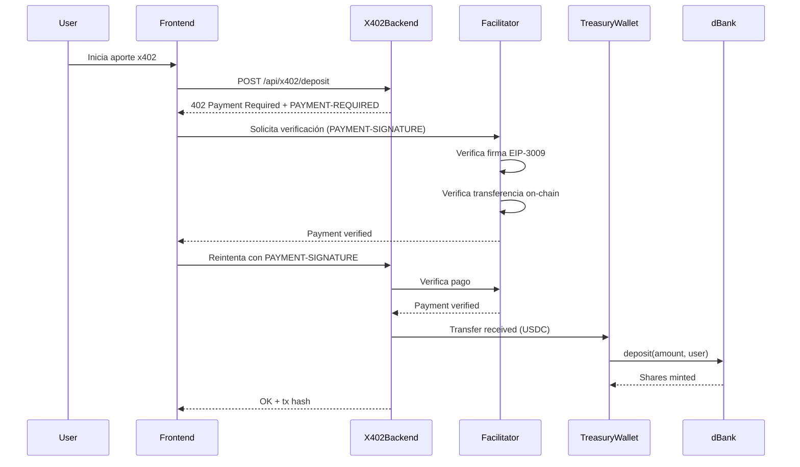

# Arquitectura x402 para dBank

## Diagrama de Flujo

## Componentes del Sistema

### 1. Facilitador (`facilitator/`)

**Responsabilidades**:
- Verificar `PAYMENT-SIGNATURE` headers
- Validar firmas EIP-3009
- Verificar liquidación on-chain
- Registrar pagos para evitar doble gasto

**Endpoints**:
- `GET /health`: Health check
- `POST /verify`: Verificar y liquidar pagos

**Tecnologías**:
- Express.js
- SQLite (base de datos de pagos)
- ethers.js (interacción blockchain)
- @x402/evm (verificación de pagos)

### 2. Backend x402 (`backend/`)

**Responsabilidades**:
- Aceptar requests de depósito protegidos por x402
- Validar montos y direcciones
- Ejecutar depósitos on-chain desde wallet tesorería
- Manejar idempotencia

**Endpoints**:
- `GET /health`: Health check
- `POST /api/x402/deposit`: Endpoint protegido por x402 middleware

**Tecnologías**:
- Express.js
- @x402/express (middleware de pago)
- ethers.js (interacción con contrato dBank)

### 3. Frontend

**Responsabilidades**:
- UI para iniciar aportes vía x402
- Manejar flujo de pago automático
- Mostrar estado de transacciones

**Tecnologías**:
- React
- @x402/fetch (cliente x402)
- ethers.js (wallet del usuario)

### 4. Wallet Tesorería

**Responsabilidades**:
- Recibir pagos USDC de usuarios
- Ejecutar `deposit()` en contrato dBank
- Mantener liquidez para depósitos

**Seguridad**:
- Hardware wallet o multisig recomendado para producción
- Private key nunca debe estar en código

## Flujo de Fondos

1. **Usuario paga**: USDC transferido vía EIP-3009 al wallet tesorería
2. **Treasury recibe**: USDC queda en el wallet tesorería
3. **Treasury deposita**: Ejecuta `dBank.deposit(amount, userAddress)`
4. **Usuario recibe**: Shares minted directamente al `userAddress`

## Seguridad e Idempotencia

### Idempotencia en Backend
- Cada request incluye `requestId` único
- Backend verifica `requestId` antes de procesar
- Si ya procesado, retorna txHash existente

### Idempotencia en Facilitador
- Cada pago tiene `paymentId` único
- Facilitador registra pagos en SQLite
- Evita verificación duplicada del mismo pago

### Validaciones
- Montos mínimos/máximos
- Direcciones válidas (checksum)
- Expiración de payment requests
- Nonce tracking (EIP-3009)

## Red y Contratos

### Base Sepolia (Testnet)
- **Chain ID**: 84532
- **USDC**: `0x036CbD53842c5426634e7929541eC2318f3dCF7e`
- **dBank**: Desplegar con este USDC como `asset`

### Configuración
- `hardhat.config.js`: Red Base Sepolia configurada
- `src/config.json`: Direcciones de contratos y x402 config

## Monitoreo

### Logs Estructurados
- Todos los servicios usan logger JSON estructurado
- Niveles: info, warn, error
- Incluyen timestamps y contexto

### Métricas Clave
- Pagos verificados por minuto
- Tiempo de verificación promedio
- Tasa de errores
- Depósitos exitosos vs. fallidos

## Escalabilidad

### Facilitador
- Puede escalar horizontalmente (stateless)
- Base de datos compartida (SQLite → PostgreSQL en producción)
- Load balancer para múltiples instancias

### Backend
- Stateless (idempotencia en memoria → Redis en producción)
- Puede escalar horizontalmente
- Rate limiting por IP/usuario
