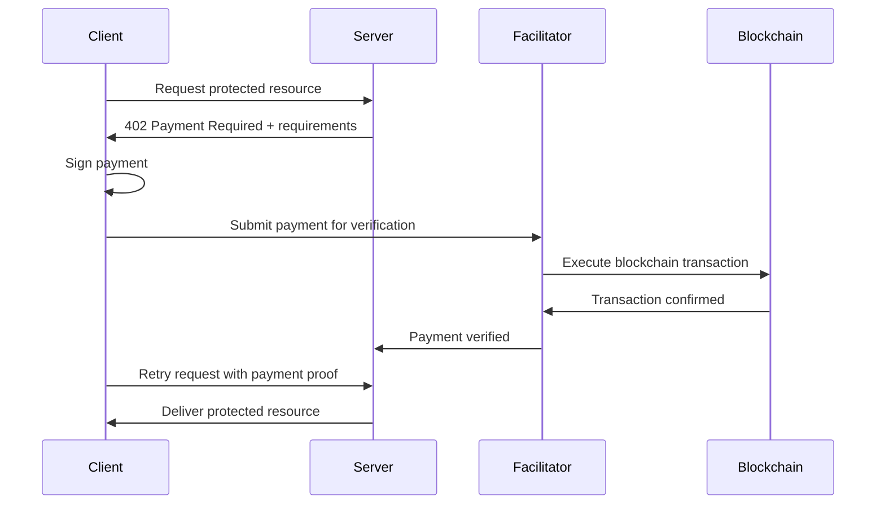
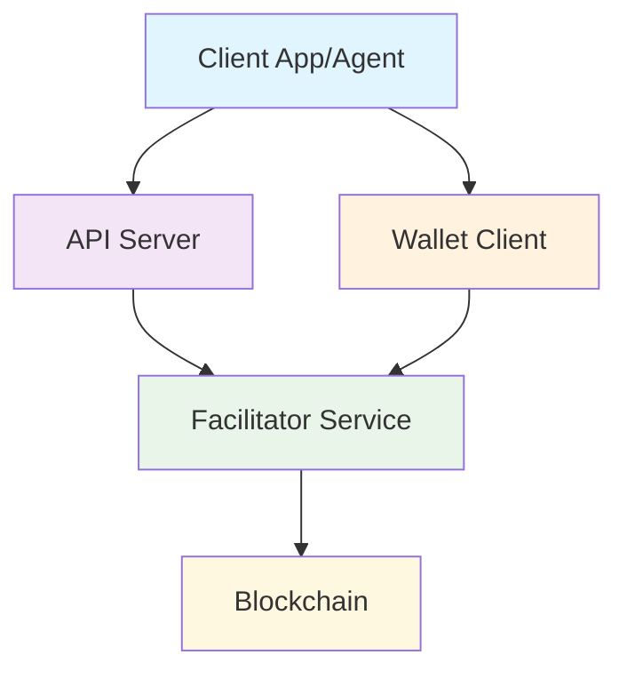
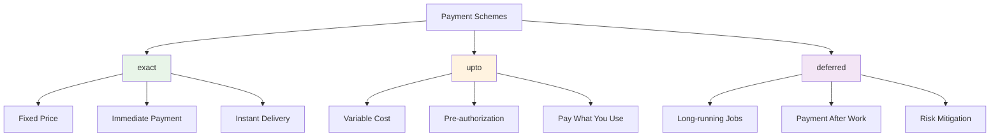
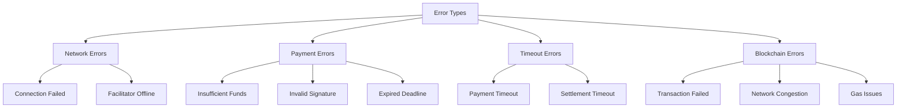
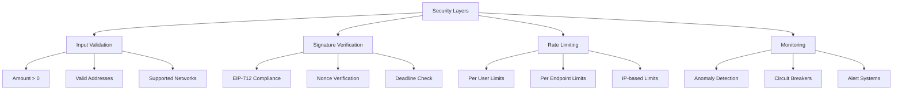
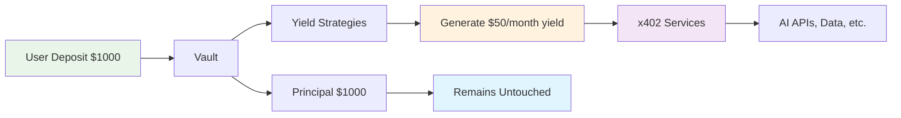
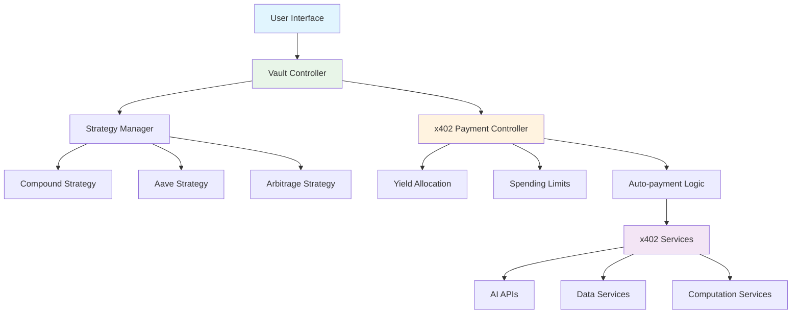

# Complete x402 Protocol Guide

## Table of Contents

1. [Introduction and Basic Concepts](#introduction-and-basic-concepts)
2. [Philosophy and History](#philosophy-and-history)
3. [Technical Architecture](#technical-architecture)
4. [Installation and Setup](#installation-and-setup)
5. [Backend Integration](#backend-integration)
6. [Frontend Integration](#frontend-integration)
7. [Advanced Payment Schemes](#advanced-payment-schemes)
8. [Custom Facilitators](#custom-facilitators)
9. [Error Handling and Edge Cases](#error-handling-and-edge-cases)
10. [Production and Monitoring](#production-and-monitoring)
11. [DeFi/Vaults Integration](#defivaults-integration)
12. [Official Documentation and References](#official-documentation-and-references)

---

## Introduction and Basic Concepts

### What is x402?

x402 is an open payment protocol developed by Coinbase that enables **instant stablecoin micropayments directly over HTTP**. It revives the HTTP 402 "Payment Required" status code that has existed since 1999 but was never practically implemented.

### Key Concepts

- **HTTP Native**: Integrates directly into standard HTTP requests
- **Frictionless**: No accounts, sessions, or complex authentication required
- **Instant**: Settlement in ~2 seconds
- **Agnostic**: Works with any blockchain and token
- **Programmable**: Ideal for AI agents and automated services

### How does the basic flow work?



---

## Philosophy and History

### Origins (1999-2025)

- **1999**: HTTP/1.1 reserves the 402 "Payment Required" code
- **25+ years**: Code remains without practical implementation
- **May 2025**: Coinbase launches x402 with a clear protocol
- **September 2025**: Cloudflare joins creating the x402 Foundation
- **October 2025**: Explosive 10,000% growth in transactions

### Design Philosophy

x402 follows fundamental principles:

- **Openness**: Open standard, not proprietary
- **Simplicity**: One line of code to monetize APIs
- **Interoperability**: Compatible with existing HTTP infrastructure
- **Decentralization**: No dependence on a single provider
- **Trust Minimization**: No unauthorized fund movement allowed

### Current Adoption

- **+100 million** transactions processed in 6 months
- **Corporate support**: Coinbase, Cloudflare, Google, Visa
- **Integration**: Claude (Anthropic), AWS, Circle
- **Ecosystem**: 10+ facilitators, 50+ projects under development

---

## Technical Architecture

### System Components



### Roles and Responsibilities

1. **Client**: Initiates requests and makes payments
2. **Resource Server**: Provides protected APIs/content
3. **Facilitator**: Verifies and settles payments on blockchain
4. **Blockchain**: Final settlement layer

### Message Formats

#### 402 Response (Payment Required)
```json
{
  "accepts": [{
    "network": "eip155:8453",
    "asset": "eip155:8453/erc20:0x833589fcd6edb6e08...",
    "amount": "1000000",
    "recipient": "0x...",
    "scheme": "exact",
    "deadline": 1703123456
  }],
  "description": "Premium API access"
}
```

#### Payment Header (X-PAYMENT)
```
X-PAYMENT: eyJ0eXAiOiJKV1QiLCJhbGciOiJIUzI1NiJ9... (Base64)
```

---

## Installation and Setup

### Main Dependencies

```bash
# Backend (Server)
npm install @x402/core @x402/evm @x402/svm @x402/express

# Frontend (Client)
npm install @x402/core @x402/evm @x402/svm @x402/fetch

# Additional support
npm install @x402/hono @x402/next @x402/axios

# Blockchain libraries
npm install ethers viem @solana/web3.js
```

### Network Configuration

```javascript
const NETWORKS = {
  "eip155:8453": {
    name: "Base",
    rpcUrl: "https://mainnet.base.org",
    usdcAddress: "0x833589fcd6edb6e08f4c7c32d4f71b54bdd3e3d"
  },
  "solana:5eykt4UsFv8P8NJdTREpY1vzqKqZKvdp": {
    name: "Solana",
    rpcUrl: "https://api.mainnet-beta.solana.com",
    usdcMint: "EPjFWdd5AufqSSqeM2qN1xzybapC8G4wEGGkZwyTDt1v"
  }
};
```

---

## Backend Integration

### Express.js Middleware

```javascript
import { paymentMiddleware } from '@x402/express';

app.use(paymentMiddleware(
  {
    "GET /premium-data": {
      accepts: [{
        network: "eip155:8453",
        asset: "0x833589fcd6edb6e08...",
        amount: "1000000", // $0.01 USDC
        scheme: "exact"
      }],
      description: "Premium data access"
    }
  },
  {
    facilitator: { url: "https://x402.cdp.coinbase.com" }
  }
));
```

### Next.js App Router

```javascript
import { x402Middleware } from '@x402/next';

const withPayment = x402Middleware({
  accepts: [{ /* payment config */ }]
});

export async function GET(request) {
  return withPayment(request, async () => {
    // Your API logic
  });
}
```

### Pricing Configuration

```javascript
const PRICING_CONFIG = {
  "GET /weather": {
    amount: "1000000",    // $0.01
    scheme: "exact"
  },
  "POST /ai-inference": {
    amount: "50000000",   // $0.50 maximum
    scheme: "upto"
  },
  "POST /heavy-computation": {
    amount: "100000000",  // $1.00 estimated
    scheme: "deferred"
  }
};
```

---

## Frontend Integration

### Basic Client with Fetch

```javascript
import { x402Fetch } from '@x402/fetch';
import { createWalletClient, custom } from 'viem';

// Configure payment client
const walletClient = createWalletClient({
  chain: base,
  transport: custom(window.ethereum)
});

const payingFetch = x402Fetch(fetch, { walletClient });

// Use as normal fetch
const response = await payingFetch('/api/premium-data');
```

### Redux Integration

```javascript
// In your Redux actions
export const fetchPremiumData = () => async (dispatch) => {
  dispatch({ type: 'FETCH_START' });
  
  try {
    // Only change fetch to payingFetch
    const response = await payingFetch('/api/premium-data');
    const data = await response.json();
    
    dispatch({ type: 'FETCH_SUCCESS', payload: data });
  } catch (error) {
    dispatch({ type: 'FETCH_ERROR', payload: error.message });
  }
};
```

### Wallet Management

#### Option 1: Connected Wallet (Recommended)
```javascript
const connectWallet = async () => {
  if (window.ethereum) {
    await window.ethereum.request({ method: 'eth_requestAccounts' });
    return createWalletClient({
      chain: base,
      transport: custom(window.ethereum)
    });
  }
};
```

#### Option 2: Allowance (For automatic micropayments)
```javascript
// User approves $10 for automatic payments
const approveSpending = async (walletClient, amount = '10.0') => {
  await walletClient.writeContract({
    address: USDC_ADDRESS,
    abi: ERC20_ABI,
    functionName: 'approve',
    args: [FACILITATOR_ADDRESS, parseUnits(amount, 6)]
  });
};
```

---

## Advanced Payment Schemes

### Payment Scheme Comparison



### "exact" Scheme (Fixed Payment)

**Use case**: Services with known price

```javascript
{
  scheme: "exact",
  amount: "1000000"  // Always $0.01
}
```

**Flow**:
1. Client requests
2. Server asks for exactly $0.01
3. Client pays $0.01
4. Server delivers immediately

### "upto" Scheme (Variable Payment)

**Use case**: Services with unpredictable cost

```javascript
{
  scheme: "upto",
  amount: "10000000"  // Up to $0.10 maximum
}
```

**Flow**:
1. Client pre-authorizes up to $0.10
2. Server executes service
3. Server charges only what was used ($0.03)
4. Client sees actual charge in receipt

### "deferred" Scheme (Deferred Payment)

**Use case**: Long-running or complex jobs

```javascript
{
  scheme: "deferred",
  amount: "50000000",  // $0.50 estimated
  deadline: 3600       // 1 hour to complete
}
```

**Flow**:
1. Client authorizes deferred payment
2. Server starts work IMMEDIATELY
3. Work completes (may take hours)
4. THEN payment is charged
5. Client receives result + receipt

---

## Custom Facilitators

### What is a Facilitator?

It's the intermediary service that:
- Verifies that payments are valid
- Executes blockchain transactions
- Confirms to the server that it can deliver the service

### Why create your own?

✅ **Advantages**:
- Total control over fees
- Custom logic (discounts, loyalty)
- Integration with existing systems
- Custom multi-chain support

### Required Endpoints

```mermaid
graph LR
    A[Custom Facilitator] --> B[/verify POST]
    A --> C[/settle POST]
    A --> D[/supported GET]
    
    B --> B1[Validate Signature]
    B --> B2[Check Funds]
    B --> B3[Return valid: true/false]
    
    C --> C1[Execute Transaction]
    C --> C2[Submit to Blockchain]
    C --> C3[Return txHash]
    
    D --> D1[List Networks]
    D --> D2[List Assets]
    D --> D3[List Schemes]
```

#### 1. /verify - Payment Verification
```javascript
POST /verify
{
  "payment": { /* payment object */ },
  "signature": "0x..."
}

Response:
{
  "valid": true
}
```

#### 2. /settle - Payment Execution
```javascript
POST /settle
{
  "payment": { /* payment object */ }
}

Response:
{
  "settled": true,
  "transactionHash": "0x..."
}
```

#### 3. /supported - Capabilities
```javascript
GET /supported

Response:
{
  "networks": ["eip155:8453", "solana:5eykt4UsFv8P8NJdTREpY1vzqKqZKvdp"],
  "assets": ["USDC", "SOL", "ETH"],
  "schemes": ["exact", "upto", "deferred"]
}
```

### Implementation with @x402/core

```javascript
import { verifyPayment, settlePayment } from '@x402/core';
import { EVMSigner } from '@x402/evm';

// Use official utilities instead of custom code
const verifyPaymentSignature = async (payment, signature) => {
  const result = await verifyPayment(payment, signature, {
    network: payment.network
  });
  return result.valid;
};

const executePayment = async (payment) => {
  const signer = new EVMSigner(process.env.FACILITATOR_PRIVATE_KEY);
  const result = await settlePayment(payment, signer);
  return result.transactionHash;
};
```

---

## Error Handling and Edge Cases

### Common Error Types



#### 1. Network Errors
```javascript
try {
  const response = await payingFetch('/api/data');
} catch (error) {
  if (error.code === 'NETWORK_ERROR') {
    // Retry with exponential backoff
  }
}
```

#### 2. Insufficient Funds
```javascript
// Facilitator should return specific error
{
  "error": "insufficient_funds",
  "required": "1000000",
  "available": "500000"
}
```

#### 3. Payment Timeout
```javascript
// For deferred payments, handle timeouts
{
  "error": "payment_timeout",
  "deadline": 1703123456,
  "current_time": 1703123500
}
```

### Retry Strategies

#### Client with Retry Logic
```javascript
const payingFetchWithRetry = async (url, options, maxRetries = 3) => {
  for (let i = 0; i < maxRetries; i++) {
    try {
      return await payingFetch(url, options);
    } catch (error) {
      if (i === maxRetries - 1) throw error;
      
      // Exponential backoff
      await new Promise(resolve => 
        setTimeout(resolve, Math.pow(2, i) * 1000)
      );
    }
  }
};
```

### Idempotency

```javascript
// Payments must be idempotent
const payment = {
  nonce: crypto.randomUUID(),  // Prevents double payment
  deadline: Date.now() + 300000  // 5 minutes
};
```

---

## Production and Monitoring

### Logging and Analytics

#### Important Metrics
- Transaction volume per endpoint
- Average settlement time
- Payment success/failure rate
- Revenue per service

#### Logging Structure
```javascript
const logPayment = {
  timestamp: Date.now(),
  endpoint: '/api/premium-data',
  amount: '1000000',
  network: 'eip155:8453',
  user: '0x...',
  status: 'success',
  txHash: '0x...',
  responseTime: 234
};
```

### Rate Limiting

#### Per User
```javascript
const rateLimiter = rateLimit({
  windowMs: 60 * 1000, // 1 minute
  max: 100, // 100 requests per minute
  keyGenerator: (req) => req.headers['x-wallet-address']
});
```

#### Per Endpoint
```javascript
const premiumLimiter = rateLimit({
  windowMs: 60 * 1000,
  max: 10, // 10 premium calls per minute
  skip: (req) => !req.headers['x-payment'] // Only if paid
});
```

### Security Best Practices



#### Input Validation
```javascript
const validatePayment = (payment) => {
  // Verify amount > 0
  // Verify deadline hasn't expired
  // Verify address formats
  // Verify network is supported
};
```

### Deployment

#### Production Environment Variables
```env
NODE_ENV=production
FACILITATOR_URL=https://x402.cdp.coinbase.com
BACKUP_FACILITATOR_URL=https://your-facilitator.com
BASE_RPC_URL=https://mainnet.base.org
SOLANA_RPC_URL=https://api.mainnet-beta.solana.com
WEBHOOK_SECRET=your-webhook-secret
ANALYTICS_API_KEY=your-analytics-key
```

#### Health Checks
```javascript
app.get('/health', async (req, res) => {
  const checks = await Promise.all([
    checkDatabase(),
    checkBlockchainConnection(),
    checkFacilitatorStatus()
  ]);
  
  res.json({
    status: checks.every(c => c.ok) ? 'healthy' : 'degraded',
    checks
  });
});
```

---

## DeFi/Vaults Integration

### Concept: Vault as Funding Source

Instead of users paying directly, **vault yields** automatically finance x402 services.



#### Smart Contract Integration
```solidity
contract VaultX402Integration {
    mapping(address => uint256) public spendingAllowance;
    mapping(address => uint256) public yieldBalance;
    
    // User authorizes spending yield on x402 services
    function enableX402Spending(uint256 maxMonthly) external {
        spendingAllowance[msg.sender] = maxMonthly;
    }
    
    // Facilitator consumes yield for payments
    function spendYieldForX402(
        address user, 
        uint256 amount
    ) external returns (bool) {
        require(msg.sender == X402_FACILITATOR);
        require(amount <= spendingAllowance[user]);
        require(amount <= yieldBalance[user]);
        
        yieldBalance[user] -= amount;
        IERC20(USDC).transfer(msg.sender, amount);
        return true;
    }
}
```

#### User Flow
1. **Deposit**: User deposits $1000 in vault
2. **Authorization**: Allows spending $50/month on AI services  
3. **Automatic usage**: Each API call consumes yield, not capital
4. **Principal intact**: The $1000 keeps generating returns

### Multi-Strategy Funding

```solidity
contract MultiStrategyVaultX402 {
    enum Strategy { COMPOUND, AAVE, CURVE, ARBITRAGE }
    
    struct X402Config {
        Strategy preferredStrategy;
        uint256 monthlyLimit;
        bool fallbackEnabled;
    }
    
    mapping(address => X402Config) public x402Configs;
    
    // User can choose which strategy funds their services
    function configureX402Funding(
        Strategy strategy,
        uint256 monthlyLimit,
        bool enableFallback
    ) external {
        x402Configs[msg.sender] = X402Config(
            strategy,
            monthlyLimit, 
            enableFallback
        );
    }
}
```

### Vault-x402 Integration Architecture



---

## Official Documentation and References

### Main Repositories

- **Core Protocol**: https://github.com/coinbase/x402
- **Official Documentation**: https://docs.cdp.coinbase.com/x402/welcome  
- **Technical Specification**: https://github.com/coinbase/x402/blob/main/specs/x402-specification.md
- **TypeScript Examples**: https://github.com/coinbase/x402/tree/main/examples/typescript

### x402 Foundation

- **Website**: https://www.x402.org/
- **Whitepaper**: https://www.x402.org/x402-whitepaper.pdf
- **Members**: Coinbase, Cloudflare, Google, Visa

### SDKs and Tools

#### Official (Coinbase)
- `@x402/core` - Base functionality
- `@x402/evm` - Ethereum/Base/Polygon support
- `@x402/svm` - Solana support
- `@x402/express` - Express.js middleware
- `@x402/next` - Next.js integration
- `@x402/fetch` - HTTP client with payments

#### Community SDKs
- **Rust**: https://github.com/x402-rs/x402-rust
- **Python**: In development
- **Go**: Community-driven
- **Solana-first**: https://corbits.dev/

### Available Facilitators

#### Coinbase Developer Platform
- **URL**: https://x402.cdp.coinbase.com
- **Networks**: Base, Base Sepolia
- **Assets**: USDC (fee-free)
- **Features**: KYT, monitoring, high availability

#### Cloudflare x402
- **URL**: TBA (in development)
- **Features**: Edge computing, global CDN
- **Integration**: Workers, Pages

#### Community Facilitators
- Updated list at: https://github.com/xpaysh/awesome-x402

### Testing Tools

- **Base Sepolia Testnet**: For cost-free testing
- **USDC Faucet**: https://faucet.circle.com/
- **Mock Facilitator**: For local development
- **Payment Simulator**: Testing utilities

---

## Learning Progress Map

```mermaid
gantt
    title x402 Learning Journey
    dateFormat  X
    axisFormat %s
    
    section Completed
    Basic Concepts           :done, basics, 0, 1
    Installation & Setup     :done, setup, 1, 2
    Backend Integration      :done, backend, 2, 3
    Frontend Integration     :done, frontend, 3, 4
    Payment Schemes          :done, schemes, 4, 5
    Custom Facilitators      :active, facilitators, 5, 6
    
    section Pending
    Error Handling          :pending, errors, 6, 7
    Production Setup        :pending, production, 7, 8
    Monitoring              :pending, monitoring, 8, 9
    DeFi Integration        :pending, defi, 9, 10
    Advanced Features       :pending, advanced, 10, 11
```

**Current Progress**: 60% Complete  
**Next Step**: Error handling and edge cases  
**Final Goal**: Full production-ready implementation with vault integration

---

## Roadmap Pending

### Upcoming Features (Q1 2026)

1. **x402 V3**
   - Enhanced session-based payments
   - Multi-asset payments in single request
   - Advanced retry mechanisms

2. **Bazaar Marketplace**
   - Discovery layer for x402 services
   - Automatic pricing negotiation
   - Service quality metrics

3. **Advanced MCP Integration**
   - Native x402 Claude agents
   - Auto-discovery of services
   - Budget management for agents

### Research Areas

1. **Cross-Chain Payments**
   - Atomic swaps in single x402 call
   - Bridge integration for better UX

2. **Privacy Features**
   - Zero-knowledge payment proofs
   - Anonymous micropayments

3. **Enterprise Features**
   - Multi-tenant billing
   - Corporate spending controls
   - Compliance reporting

---

## Recommended Use Cases

### For Your Stack (AI + Blockchain)

1. **RAG Systems**: Charge per document query
2. **AI Inference**: Pay-per-token for custom models
3. **Blockchain Data**: On-chain analytics APIs
4. **Cross-chain Analytics**: Multi-network services

### For Autonomous Agents

1. **Agent-to-Agent Commerce**: Agents paying each other
2. **Automated Research**: Agents buying premium data
3. **Computational Markets**: Agents renting GPU/CPU
4. **Data Marketplaces**: Agents selling insights

---

## Implementation Priority

### Phase 1: Basic Implementation (Week 1)
- [x] Install x402 SDKs
- [x] Basic backend middleware
- [x] Simple frontend integration
- [x] Test with Coinbase facilitator

### Phase 2: Advanced Features (Week 2-3)
- [ ] Custom facilitator development
- [ ] Multiple payment schemes
- [ ] Error handling and retry logic
- [ ] Production monitoring

### Phase 3: DeFi Integration (Week 4-6)
- [ ] Vault-x402 smart contracts
- [ ] Multi-strategy funding
- [ ] Automated yield allocation
- [ ] Advanced user interfaces

---

*Document created as complete reference for x402 protocol. Updated: December 2025*

*For specific DApp implementation, see separate document: "x402_dapp_implementation.md"*